# Hướng dẫn sử dụng ReviewTrans Studio

ReviewTrans Studio dịch, lồng tiếng và chèn phụ đề tự động cho video review phim / video thuyết minh.
Tài liệu này đi qua toàn bộ tính năng, ảnh minh hoạ lấy từ project mẫu **bomnguyentu** (video giải thích bom
nguyên tử, tiếng Trung → tiếng Việt, 375 câu).

**Mục lục**

1. [Cài đặt](#1-cài-đặt)
2. [Chuẩn bị lần đầu](#2-chuẩn-bị-lần-đầu)
3. [Providers: dịch và lồng tiếng](#3-providers-dịch-và-lồng-tiếng)
4. [Project và video](#4-project-và-video)
5. [Ngữ cảnh chung](#5-ngữ-cảnh-chung)
6. [Cấu hình project](#6-cấu-hình-project)
7. [Editor](#7-editor)
8. [Quy trình xử lý một video](#8-quy-trình-xử-lý-một-video)
9. [Hàng đợi](#9-hàng-đợi)
10. [Preset phụ đề](#10-preset-phụ-đề)
11. [Tài nguyên](#11-tài-nguyên)
12. [Công cụ: ghép video](#12-công-cụ-ghép-video)
13. [Cài đặt chung](#13-cài-đặt-chung)
14. [Phím tắt](#14-phím-tắt)
15. [Câu hỏi thường gặp và xử lý lỗi](#15-câu-hỏi-thường-gặp-và-xử-lý-lỗi)

---

## 1. Cài đặt

Có hai bản, tải ở mục **Releases** của repo:

| Bản | Cách dùng |
|---|---|
| `ReviewTrans-x.y.z-setup.exe` | Chạy file và bấm Next. Không cần quyền admin; app được cài vào `%LOCALAPPDATA%\Programs\ReviewTrans`, có shortcut ở Start Menu. Cài bản mới đè lên bản cũ, cài đặt và project được giữ nguyên. |
| `ReviewTrans-x.y.z-portable.zip` | Giải nén ra đâu cũng được, chạy `ReviewTrans.exe`. Mọi dữ liệu (cài đặt, project, model) nằm trong thư mục `data\` cạnh exe, nên mang cả thư mục sang máy khác vẫn dùng được. |

Chạy từ mã nguồn:

```bat
python -m venv .venv
.venv\Scripts\pip install -r requirements.txt
.venv\Scripts\python main.py
```

> Bản cài đặt đã kèm sẵn FFmpeg, whisper.cpp và libmpv. Khi chạy từ mã nguồn thì tải chúng ở trang **Tài nguyên** (mục 11).

## 2. Chuẩn bị lần đầu

Làm theo thứ tự dưới đây là dùng được ngay:

1. **Tài nguyên**: kiểm tra FFmpeg, whisper.cpp, libmpv đều có dấu ✓, rồi tải **model Whisper** (khuyên dùng `small`
   hoặc `medium`; muốn chính xác cao thì dùng `large-v3-turbo`).
2. **Providers**: thêm provider dịch (ví dụ API kiểu OpenAI) và provider lồng tiếng, bấm **Kiểm tra kết nối**,
   rồi **Đặt mặc định**.
3. **Project**: tạo project, thêm video.
4. **Editor**: bấm **Chạy tất cả ▾ → Chạy tất cả bước còn thiếu**, xem lại kết quả rồi **Xuất video**.

Nếu đã dùng bản cũ, cấu hình cũ (API key Gemini/OpenAI, vBee, Custom TTS) được tự chuyển thành provider khi mở app lần đầu.

## 3. Providers: dịch và lồng tiếng

Trang **Providers** chứa các cấu hình kết nối dùng chung cho mọi project. Mỗi cấu hình là một *profile*; có thể
tạo nhiều profile cùng loại (ví dụ hai server kiểu OpenAI khác nhau). Profile có dấu ★ là **mặc định**.

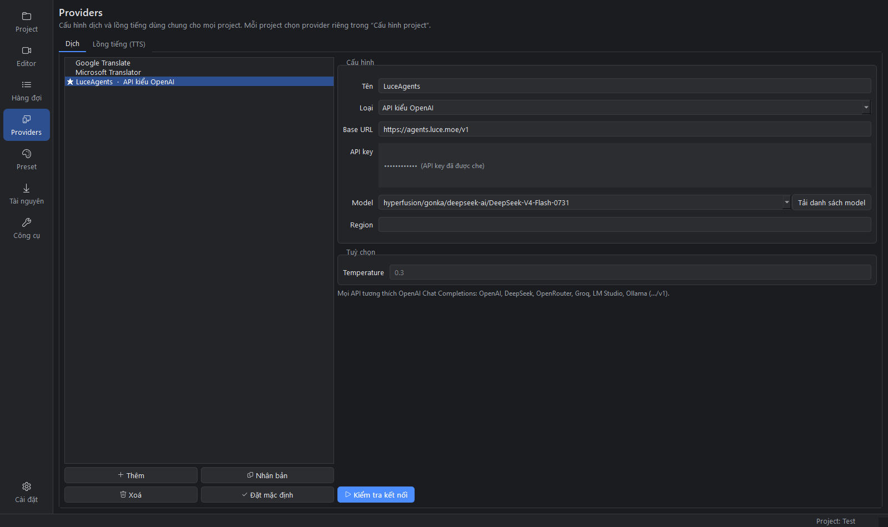

**Các loại provider dịch**

| Loại | Ghi chú |
|---|---|
| Google Translate | Không cần key (endpoint web miễn phí). Có key Google Cloud thì dùng Cloud Translation v2, ổn định hơn. |
| Microsoft Translator | Không cần key (token miễn phí của Edge). Có key Azure thì điền key và Region. |
| API kiểu OpenAI | OpenAI, DeepSeek, OpenRouter, Groq, LM Studio, Ollama… Điền **Base URL** (thường kết thúc bằng `/v1`), key và model. |
| API kiểu Gemini | Google AI Studio hoặc proxy tương thích. |
| Anthropic (Claude) | Để trống Base URL để dùng API chính thức. |

- **API key**: mỗi dòng một key. App tự xoay vòng giữa các key khi bị giới hạn quota.
- **Tải danh sách model**: lấy danh sách model từ server rồi chọn, không phải gõ tay.
- **Kiểm tra kết nối**: dịch thử “你好，世界” để xác nhận cấu hình đúng.
- Chỉ các provider LLM (OpenAI/Gemini/Anthropic) mới **dùng ngữ cảnh chung** và **tự cập nhật ngữ cảnh**.
  Google/Microsoft chỉ áp glossary bằng cách thay thuật ngữ trực tiếp vào câu gốc.

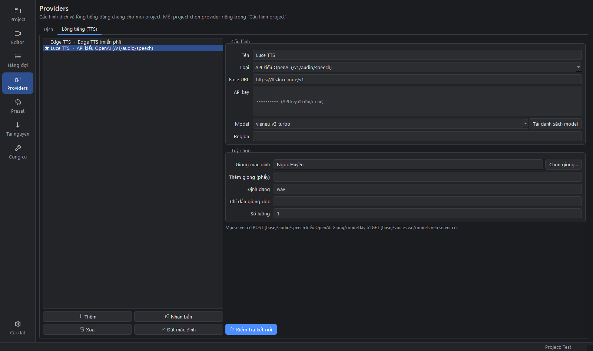

**Các loại provider lồng tiếng (TTS)**

| Loại | Ghi chú |
|---|---|
| Edge TTS | Miễn phí, không cần key. Ví dụ giọng: `vi-VN-HoaiMyNeural`, `vi-VN-NamMinhNeural`. |
| vBee | Điền token vào ô API key, App ID ở phần Tuỳ chọn. |
| API kiểu OpenAI (`/v1/audio/speech`) | OpenAI hoặc server TTS tự host. App tự đọc danh sách giọng (`GET /v1/voices`) và model (`GET /v1/models`) nếu server có. Bấm **Chọn giọng…** để chọn. |
| Custom API (bản cũ) | Tương thích API TTS của bản cũ. |

Mục **Tuỳ chọn** của TTS:

- **Định dạng**: nên để `wav`.
- **Số luồng**: số câu được tạo song song. Server yếu thì để 1.
- **Chỉ dẫn giọng đọc**: dùng cho model `gpt-4o-mini-tts`.

## 4. Project và video

Một **project** tương ứng một bộ phim hoặc một series. Project chứa nhiều video xếp theo thứ tự tập, và các video
dùng chung ngữ cảnh dịch.

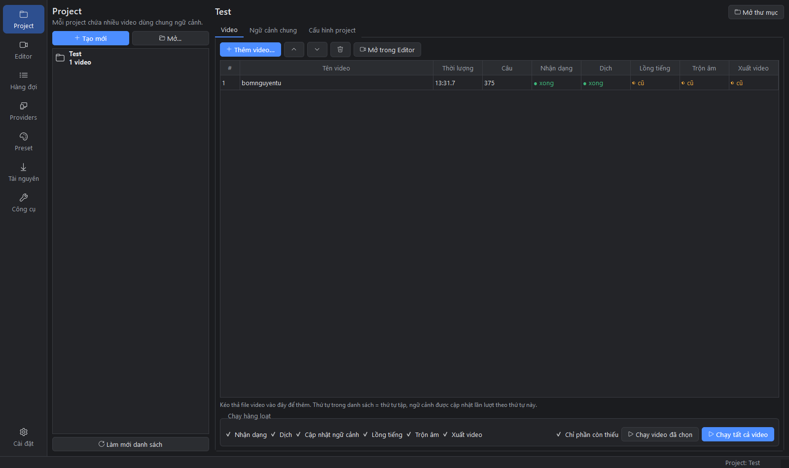

- **Tạo mới**: đặt tên project. Thư mục project được tạo trong `%USERPROFILE%\ReviewTrans Projects`
  (bản portable: `data\projects`; đổi được ở Cài đặt).
- **Mở…**: mở một thư mục project có sẵn, ví dụ project được chép từ máy khác.
- **Thêm video…** hoặc **kéo thả file video** vào bảng. Video được sắp xếp theo tên tự nhiên (Tập 2 đứng trước Tập 10).
- **▲ ▼**: đổi thứ tự tập. Thứ tự này quyết định thứ tự cập nhật ngữ cảnh khi chạy hàng loạt.
- Các cột **Nhận dạng / Dịch / Lồng tiếng / Trộn âm / Xuất video** cho biết trạng thái từng bước:
  `● xong`, `◐ cũ` (cần chạy lại vì dữ liệu đã đổi), `✕ lỗi` (rê chuột để xem lỗi), `○` chưa chạy.
- **Chạy hàng loạt**: tích các bước cần chạy, chọn **Chạy video đã chọn** hoặc **Chạy tất cả video**.
  Để tích **Chỉ phần còn thiếu** thì những câu đã dịch hoặc đã lồng tiếng sẽ không làm lại.

Dữ liệu project nằm trọn trong thư mục project (`project.json`, `context.json`, `videos\…`, `output\`), nên có thể
sao lưu hoặc mang sang máy khác nguyên thư mục.

## 5. Ngữ cảnh chung

Ngữ cảnh giúp bản dịch nhất quán giữa các tập: tên nhân vật, cách xưng hô, thuật ngữ. Ngữ cảnh được đưa vào
prompt mỗi khi dịch bằng LLM.

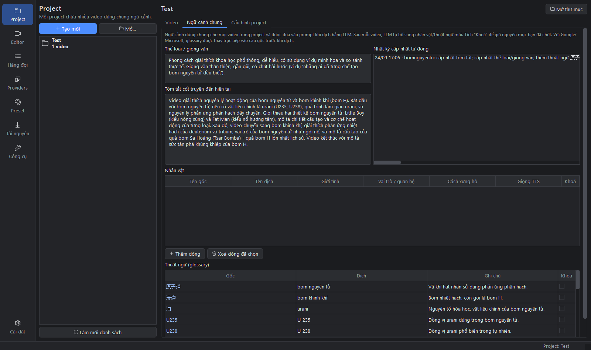

- **Thể loại / giọng văn**: ví dụ “phong cách giải thích khoa học phổ thông, giọng thân thiện”.
- **Tóm tắt cốt truyện**: LLM tự viết và cập nhật sau mỗi video.
- **Nhân vật**: tên gốc → tên dịch, giới tính, vai trò, **cách xưng hô** (ví dụ “gọi A là sư phụ, tự xưng đệ tử”),
  và **giọng TTS riêng** cho nhân vật đó.
- **Thuật ngữ (glossary)**: gốc → dịch, kèm ghi chú. Mục chữ xanh là do LLM tự thêm.
- **Khoá**: tích ô này thì LLM không được sửa mục đó nữa. Mục bạn tự thêm được khoá sẵn.
- **Nhật ký cập nhật tự động**: xem LLM đã thêm/sửa gì sau mỗi video.

> Tự cập nhật ngữ cảnh chỉ chạy khi provider dịch (hoặc “LLM cập nhật ngữ cảnh” trong Cấu hình project) là LLM.

## 6. Cấu hình project

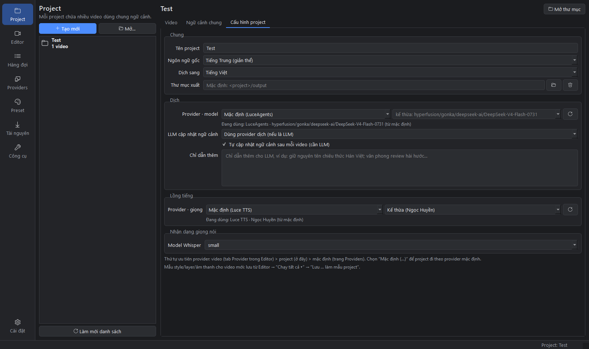

- **Ngôn ngữ gốc / Dịch sang**, **Thư mục xuất** (mặc định `<project>\output`).
- **Dịch → Provider · model**: provider dùng cho cả project. Chọn “Mặc định (…)” để đi theo provider mặc định ở
  trang Providers. Ô model để trống thì dùng model của provider; nút ⟳ tải danh sách model từ API.
  Dòng **Đang dùng: …** cho biết giá trị thực tế và nó lấy từ đâu.
- **LLM cập nhật ngữ cảnh**: có thể dùng một LLM khác cho việc cập nhật ngữ cảnh, ví dụ dịch bằng Google nhưng
  cập nhật ngữ cảnh bằng Gemini.
- **Chỉ dẫn thêm**: yêu cầu riêng cho LLM, ví dụ “giữ nguyên tên chiêu thức Hán Việt”.
- **Lồng tiếng → Provider · giọng**, **Model Whisper**.

**Thứ tự ưu tiên provider: video > project > mặc định.** Mỗi video có thể dùng provider riêng (tab Provider trong
Editor, xem 7.8). Cấp nào để “kế thừa” thì lấy giá trị ở cấp trên.

## 7. Editor

Editor là nơi xem, sửa và dựng từng video.

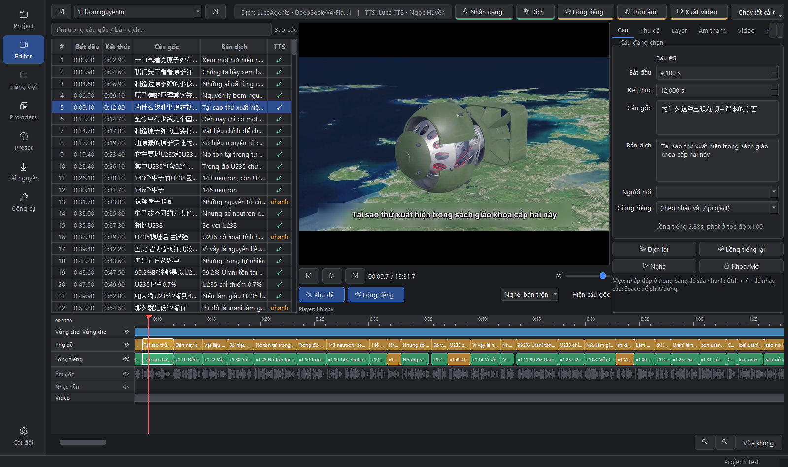

Bố cục gồm:

- **Thanh trên cùng**: chọn video, thông tin provider đang dùng, các nút chạy từng bước.
- **Bên trái**: bảng câu thoại.
- **Ở giữa**: khung phát.
- **Bên phải**: inspector, gồm 6 tab.
- **Dưới cùng**: timeline.

Có thể kéo các đường chia giữa các khung; kích thước được nhớ cho lần mở sau.

### 7.1 Thanh trên cùng

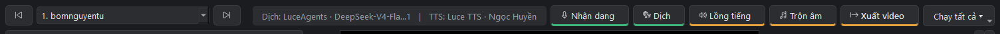

- **◀ Video ▶**: chuyển video trong project.
- **Dịch: … | TTS: …**: provider và model/giọng mà video này đang dùng. Bấm vào để mở tab Provider.
- **Nhận dạng / Dịch / Lồng tiếng / Trộn âm / Xuất video**: chạy từng bước cho video hiện tại (việc được đưa vào
  Hàng đợi). Vạch màu dưới mỗi nút là trạng thái bước đó: xanh lá = xong, cam = cần chạy lại, đỏ = lỗi, xám = chưa chạy.
- **Chạy tất cả ▾**:

  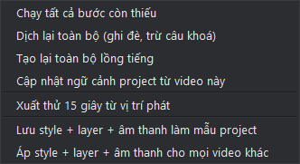

  - *Chạy tất cả bước còn thiếu*: nhận dạng (nếu chưa có câu) → dịch → cập nhật ngữ cảnh → lồng tiếng → trộn âm → xuất.
  - *Dịch lại toàn bộ*: dịch đè mọi câu, trừ câu đã khoá.
  - *Tạo lại toàn bộ lồng tiếng*.
  - *Cập nhật ngữ cảnh project từ video này*.
  - *Xuất thử 15 giây từ vị trí phát*: xuất nhanh một đoạn ngắn để kiểm tra phụ đề, layer và âm thanh đúng như bản cuối.
  - *Lưu style + layer + âm thanh làm mẫu project*: video thêm sau sẽ dùng mẫu này.
  - *Áp style + layer + âm thanh cho mọi video khác*.

### 7.2 Bảng câu thoại

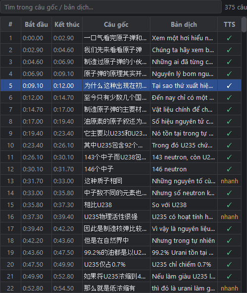

- Nhấp một câu để nhảy tới câu đó. **Nhấp đúp** vào ô Bắt đầu/Kết thúc/Câu gốc/Bản dịch để sửa trực tiếp
  (thời gian nhập dạng `0:09.10` hoặc `9.1`).
- Ô tìm kiếm phía trên lọc theo câu gốc và bản dịch.
- Cột **TTS**: `✓` đã có lồng tiếng, `—` chưa có, `cũ` (bản dịch hoặc giọng đã đổi, cần tạo lại),
  `nhanh` (lồng tiếng phải tăng tốc hơn 1.35 lần mới vừa khung câu; nên rút gọn bản dịch).
- Bản dịch trống hiện chữ đỏ.
- **Chuột phải** để mở menu thao tác (chọn nhiều câu bằng Ctrl/Shift):

  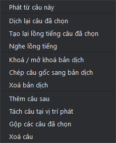

  - *Tách câu tại vị trí phát*: đặt đầu phát vào giữa câu rồi chọn; câu gốc và bản dịch được cắt theo tỉ lệ.
  - *Gộp các câu đã chọn*, *Thêm câu sau*, *Xoá câu* (hoặc phím Delete).
  - *Khoá / mở khoá bản dịch*: câu đã khoá không bị dịch đè khi chạy lại.

### 7.3 Khung phát

- Phụ đề, layer ảnh/chữ và vùng che được vẽ trực tiếp lên video, giống với bản xuất. Vùng che trong khung phát là
  làm mờ xấp xỉ; muốn xem chính xác thì dùng *Xuất thử 15 giây*.
- **Phát/dừng**: Space. **Câu trước/sau**: Ctrl+← / Ctrl+→.
- **Phụ đề / Lồng tiếng**: bật/tắt phụ đề và lồng tiếng **trong video xuất**.
- **Nghe: bản trộn / âm gốc**:
  - *Bản trộn* là âm gốc đã chỉnh (giảm hoặc tắt), cộng lồng tiếng và nhạc nền, giống hệt khi xuất. Mỗi khi đổi
    âm lượng hoặc track, app tự trộn lại bản nghe thử sau khoảng 1 giây. Lần đầu mở một video dài có thể mất vài chục giây.
  - *Âm gốc* là âm thanh gốc chưa chỉnh.
- **Hiện câu gốc**: hiện câu gốc thay cho bản dịch trên khung phát.
- Dòng chữ nhỏ dưới player cho biết đang dùng player nào (libmpv hay Qt) và trạng thái bản trộn.

### 7.4 Timeline

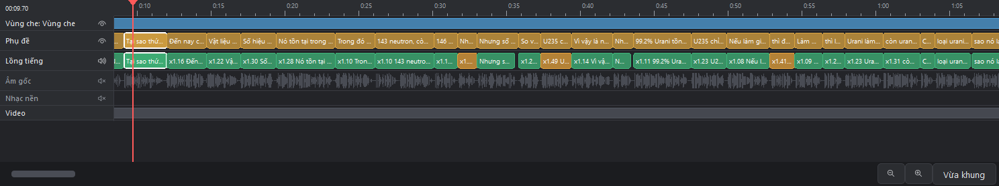

- Các track từ trên xuống: **layer** (mỗi layer một hàng), **Phụ đề**, **Lồng tiếng**, **Âm gốc** (sóng âm hiện
  sau khi nhận dạng), **Nhạc nền**, **Video**.
- Biểu tượng mắt/loa ở đầu track dùng để bật/tắt track đó (với layer là bật/tắt từng layer).
- **Nhấp** vào thước đo để tua, **kéo** thước đo để lướt.
- **Kéo khối phụ đề** để dời câu; **kéo mép khối** để đổi thời điểm bắt đầu/kết thúc. Khối layer kéo được tương tự.
- Khối lồng tiếng có ghi `x1.30` là phải tăng tốc 1.3 lần; màu cam là tăng tốc nhiều.
- **Ctrl + lăn chuột** để phóng to/thu nhỏ, lăn chuột để cuộn ngang. **Vừa khung** để xem toàn bộ video.

### 7.5 Tab Câu

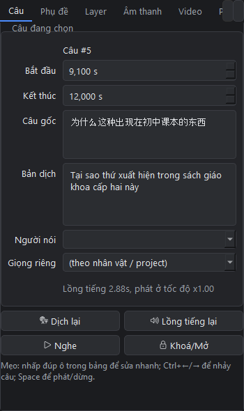

Chi tiết câu đang chọn: thời gian chính xác đến mili giây, câu gốc, bản dịch, **người nói** (khớp với nhân vật
trong ngữ cảnh để dùng giọng riêng của nhân vật), **giọng riêng** cho câu này, và thông tin lồng tiếng
(độ dài, tốc độ phát). Các nút:

- **Dịch lại**: dịch lại chỉ câu này, có dùng ngữ cảnh.
- **Lồng tiếng lại**: tạo lại lồng tiếng câu này rồi phát nghe luôn.
- **Nghe**: phát file lồng tiếng của câu.
- **Khoá/Mở**.

**Thứ tự chọn giọng của một câu**: giọng riêng của câu > giọng của nhân vật (theo người nói) > giọng của video/project >
giọng mặc định của provider.

### 7.6 Tab Phụ đề

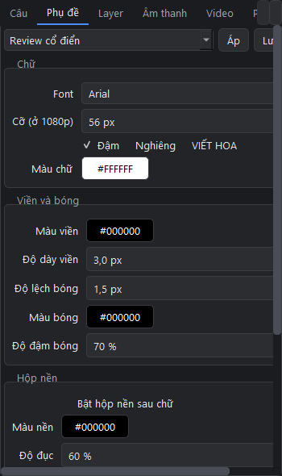

- **Preset**: chọn một preset rồi bấm **Áp**; **Lưu preset** để lưu style hiện tại.
- **Chữ**: font, cỡ chữ (tính theo video 1080p, tự co giãn theo độ phân giải thật), đậm, nghiêng, VIẾT HOA, màu chữ.
- **Viền và bóng**: màu và độ dày viền, độ lệch/màu/độ đậm của bóng.
- **Hộp nền**: hộp màu phía sau chữ, chỉnh được màu, độ đục và đệm.
- **Vị trí**: dưới/giữa/trên, lề dọc, lề ngang, số ký tự tối đa mỗi dòng (“Tự động” = tự xuống dòng theo độ rộng).

### 7.7 Tab Layer

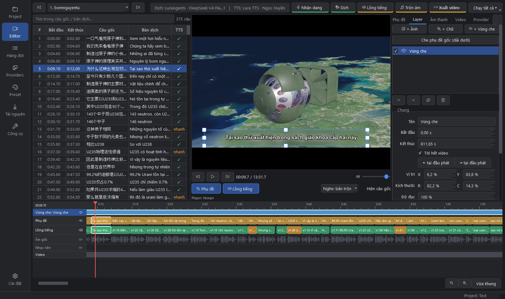

Ba loại layer:

- **Ảnh**: logo, watermark (PNG trong suốt), chỉnh được độ đục, có thể giữ tỉ lệ ảnh.
- **Chữ**: tiêu đề, tên kênh…; có font, màu, viền và nền riêng.
- **Vùng che**: *Làm mờ*, *Pixel hoá* hoặc *Tô màu đặc*, dùng để che chữ cứng, logo của video gốc.
  Nút **Che phụ đề gốc (dải dưới)** tạo nhanh một vùng làm mờ 15% phía dưới khung hình.

Cách chỉnh:

- **Kéo layer trực tiếp trên khung phát** để di chuyển; kéo 8 ô vuông ở viền để đổi kích thước.
- Chỉnh số chính xác (vị trí, kích thước theo % khung hình, thời gian) ở form bên phải.
  Nút **⇤/⇥ tại đầu phát** đặt thời điểm bắt đầu/kết thúc bằng vị trí đang phát. Tích **Tới hết video** để layer kéo dài tới cuối.
- Trong danh sách layer, layer ở trên cùng được vẽ đè lên trên. **▲ ▼** đổi thứ tự, có nút nhân bản và xoá. Bỏ tích để tạm ẩn layer.
- Phụ đề luôn nằm trên mọi layer.

### 7.8 Tab Âm thanh, Video, Provider

| Âm thanh | Video | Provider |
|---|---|---|
| 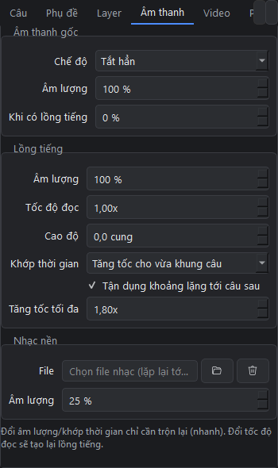 | 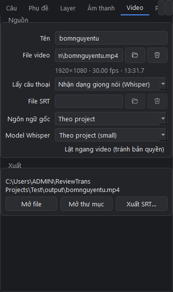 | 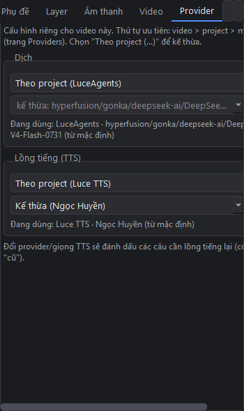 |

**Âm thanh**

- *Âm thanh gốc*:
  - Chế độ **Giảm khi có lồng tiếng** (âm gốc tự nhỏ lại trong lúc có lồng tiếng), **Giữ nguyên** hoặc **Tắt hẳn**.
  - **Âm lượng** chung và **mức giảm khi có lồng tiếng**.
- *Lồng tiếng*:
  - Âm lượng, **tốc độ đọc** (gửi cho TTS nên đổi thì phải lồng tiếng lại), **cao độ**.
  - **Khớp thời gian**: *Tăng tốc cho vừa khung câu* hoặc *Giữ tốc độ tự nhiên*.
  - **Tận dụng khoảng lặng tới câu sau**: dùng thêm khoảng trống trước câu kế tiếp, nên ít phải tăng tốc hơn.
  - **Tăng tốc tối đa**.
- *Nhạc nền*: file nhạc (tự lặp tới hết video) và âm lượng.

Đổi âm lượng hay chế độ chỉ cần trộn lại (nhanh), không phải lồng tiếng lại.

**Video**

- Tên video, file nguồn (đổi được nếu file bị di chuyển).
- *Lấy câu thoại*: **Whisper** (nhận dạng giọng nói) hoặc **file SRT có sẵn**.
- Ngôn ngữ gốc, model Whisper riêng cho video.
- **Lật ngang video** (giảm khả năng bị quét trùng nội dung).
- Mở file hoặc thư mục đã xuất, **Xuất SRT…** (bản dịch hoặc câu gốc).

**Provider**: provider dịch + model và provider TTS + giọng **riêng cho video này**. Chọn “Theo project (…)” để
kế thừa. Đổi provider hoặc giọng TTS thì các câu chuyển sang trạng thái `cũ` ở cột TTS, cần lồng tiếng lại.

## 8. Quy trình xử lý một video

1. **Thêm video** vào project (mục 4).
2. **Nhận dạng**: Whisper tạo câu thoại từ âm thanh. Nếu đã có phụ đề, chọn *Dùng file SRT có sẵn* ở tab Video
   rồi bấm Nhận dạng để nạp file.
3. **Dịch** (tự cập nhật ngữ cảnh ngay sau đó): xem lại bảng câu, sửa những câu dịch chưa hay, khoá câu đã ưng ý.
4. **Lồng tiếng**: xem cột TTS; câu `nhanh` thì rút gọn bản dịch rồi bấm *Lồng tiếng lại* cho câu đó.
5. Chỉnh **phụ đề, layer, âm thanh**; nghe thử bằng chế độ *Nghe: bản trộn*; *Xuất thử 15 giây* để kiểm tra.
6. **Xuất video**: file `.mp4` và `.srt` nằm trong thư mục `output` của project.

Mỗi bước được lưu lại (cache). Sửa một câu chỉ làm câu đó phải chạy lại; các bước sau được đánh dấu `cần chạy lại`
(vạch cam) để bạn biết cần làm gì tiếp.

## 9. Hàng đợi

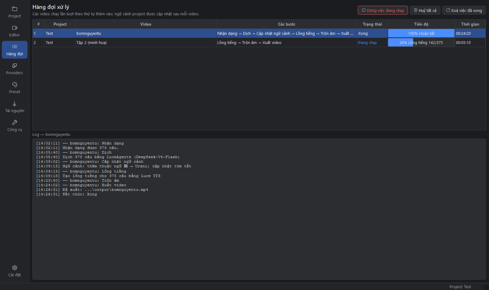

*Ảnh minh hoạ: dòng thứ hai là job ví dụ.*

- Mọi việc chạy nền đều nằm ở đây, **lần lượt theo thứ tự thêm vào**. Nhờ vậy ngữ cảnh được cập nhật theo đúng thứ tự tập.
- Chọn một dòng để xem log chi tiết. Chuột phải để *Huỷ/dừng*, *Chạy lại* hoặc *Chép log* (gửi kèm khi báo lỗi).
- Video đang được xử lý bị **khoá chỉnh sửa** trong Editor (có dải thông báo màu cam); dữ liệu tự cập nhật khi xong.
- Thanh trạng thái dưới cùng cửa sổ luôn hiện tiến độ của việc đang chạy.

## 10. Preset phụ đề

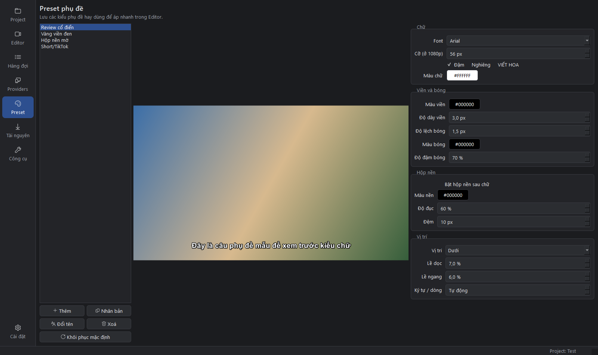

Lưu các kiểu phụ đề hay dùng (có sẵn: Review cổ điển, Vàng viền đen, Hộp nền mờ, Short/TikTok). Sửa ở cột phải,
xem trước ở giữa. Áp preset trong Editor ở tab Phụ đề.

## 11. Tài nguyên

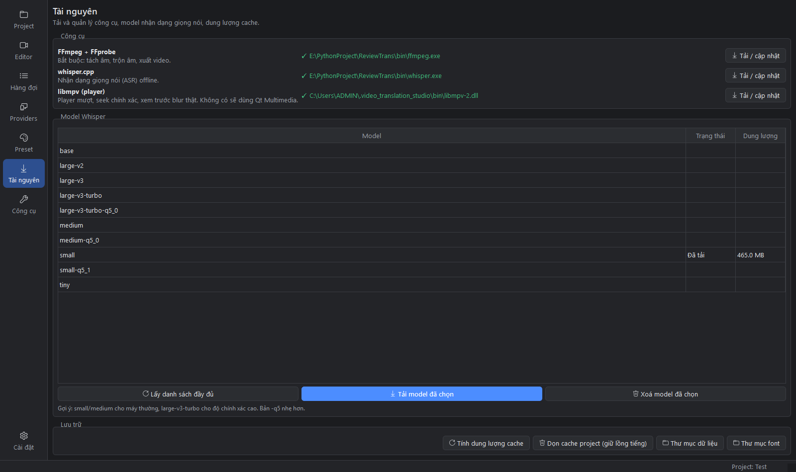

- **Công cụ**: FFmpeg (bắt buộc), whisper.cpp (nhận dạng), libmpv (player mượt hơn, tua chính xác). Bấm
  **Tải / cập nhật** để tải bản mới. Sau khi tải libmpv, khởi động lại app.
- **Model Whisper**: *Lấy danh sách đầy đủ* từ Hugging Face, chọn rồi *Tải model đã chọn*.
  Model càng lớn càng chính xác nhưng càng chậm; bản `-q5` nhẹ hơn.
- **Lưu trữ**: xem dung lượng cache của project, **dọn cache** (giữ lại file lồng tiếng từng câu), mở thư mục dữ liệu
  và **thư mục font**. Font chép vào thư mục font dùng được cho cả khung phát lẫn video xuất (khởi động lại app để khung phát nhận font mới).

## 12. Công cụ: ghép video

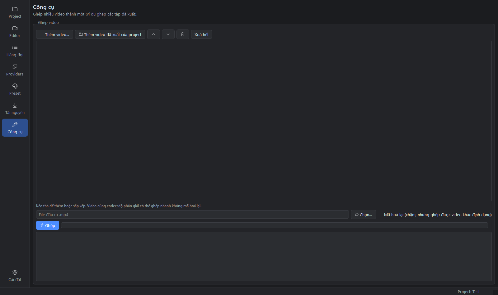

Ghép nhiều video thành một, ví dụ ghép các tập đã xuất. Thêm file (hoặc kéo thả, hoặc *Thêm video đã xuất của project*),
sắp xếp thứ tự, chọn file đầu ra rồi bấm **Ghép**. Các video cùng định dạng được ghép rất nhanh vì không mã hoá lại.
Video khác định dạng thì tích **Mã hoá lại**.

## 13. Cài đặt chung

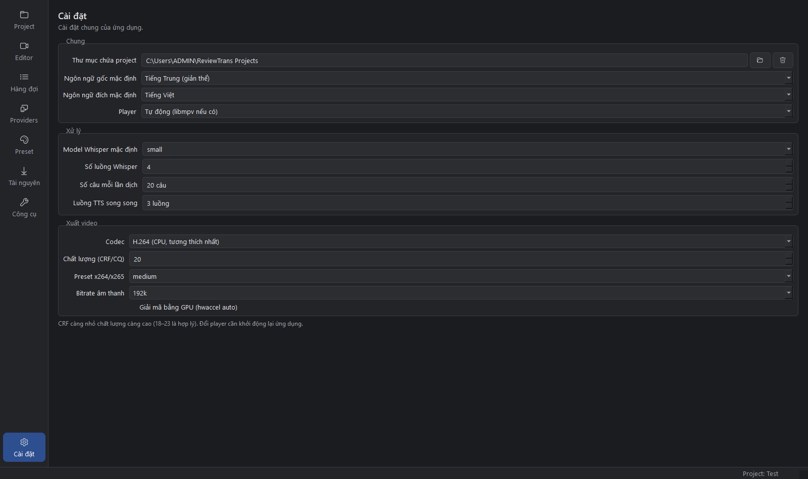

- Thư mục chứa project, ngôn ngữ mặc định.
- **Player**: tự động (libmpv nếu có), libmpv hoặc Qt. Đổi xong cần khởi động lại.
- Model Whisper mặc định, số luồng Whisper, **số câu mỗi lần dịch** (giảm nếu LLM hay trả thiếu dòng),
  số luồng TTS song song.
- **Xuất video**:
  - Codec: H.264/H.265 bằng CPU, hoặc NVENC nếu có card NVIDIA (nhanh hơn nhiều).
  - CRF/CQ: nhỏ = đẹp hơn, 18–23 là hợp lý.
  - Preset và bitrate âm thanh.

## 14. Phím tắt

| Phím | Tác dụng |
|---|---|
| Space | Phát / dừng |
| Ctrl + ← / → | Câu trước / câu sau |
| Alt + ← / → | Lùi / tới 3 giây |
| Ctrl + S | Lưu ngay (app vẫn tự lưu sau mỗi lần sửa) |
| Nhấp đúp vào ô trong bảng câu | Sửa trực tiếp |
| Delete (trong bảng câu) | Xoá các câu đang chọn |
| Ctrl + lăn chuột trên timeline | Phóng to / thu nhỏ |

## 15. Câu hỏi thường gặp và xử lý lỗi

**Đổi provider mặc định nhưng project vẫn dùng provider cũ?**
Project hoặc video đang chọn riêng một provider. Xem dòng **Đang dùng: … (từ video/project/mặc định)** ở tab
Provider (Editor) hoặc Cấu hình project, rồi chọn “Theo project (…)” / “Mặc định (…)” để kế thừa.

**Lỗi TTS `unknown voice 'alloy'`?**
Server TTS không có giọng đó. Vào Providers → profile TTS → **Chọn giọng…** để chọn một giọng mà server hỗ trợ.

**Dịch bị thiếu hoặc lệch dòng?**
App tự thử lại và chia nhỏ batch. Nếu vẫn lỗi, giảm *Số câu mỗi lần dịch* trong Cài đặt, hoặc đổi sang model tốt hơn.

**Chỉnh âm lượng gốc nhưng nghe vẫn như cũ?**
Kiểm tra chế độ đang là *Nghe: bản trộn*, và đợi dòng “đang trộn lại bản nghe thử…” dưới player biến mất.

**Khung phát đen hoặc giật?**
Vào Tài nguyên tải libmpv rồi khởi động lại. Nếu vẫn lỗi, chọn Player = Qt Multimedia trong Cài đặt.

**Không nhận dạng được (Whisper lỗi)?**
Kiểm tra whisper.cpp và model ở trang Tài nguyên, và chọn đúng ngôn ngữ gốc. Video không có tiếng nói rõ
(chỉ có nhạc) thì Whisper có thể trả về rất ít câu.

**Phụ đề trong video xuất dùng sai font?**
Font cần được cài vào Windows, hoặc chép vào *thư mục font* (Tài nguyên → Thư mục font).

**Báo lỗi cho nhà phát triển**
Vào Hàng đợi, chuột phải job bị lỗi → **Chép log**, rồi gửi kèm mô tả lỗi.
